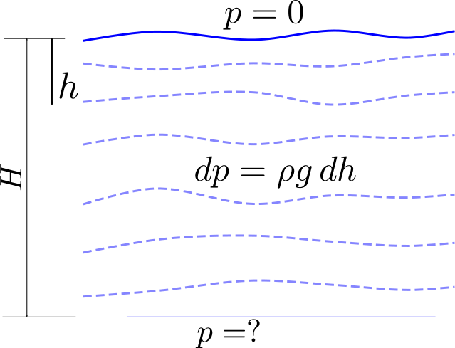

# Introduction to CFD
## Background and Motivation
Computational fluid dynamics, commonly known by its abbreviation CFD, is made of three words. The word ‘computational’ stands for techniques which can be programmed effectively to solve problems using computers. The techniques used in CFD are numerical in nature and computers are used to do repetitive logical computations. The words, ‘fluid and dynamics’ means related to gases and liquids in motion and being acted upon by forces or imparting forces on other objects. However, the currently available software using the CFD techniques are not limited only to fluid dynamics. The techniques learnt in CFD are applicable to any physical phenomena which can be modeled in form of partial differential equations (PDEs) or integral equations. The governing equations for a well understood physical phenomenon, under the assumption of continuum, is fairly easy to obtain and test for simple problems. On the other hand, solving these PDEs for complicated geometries (for real world applications) and arbitrary time scales is not very easy and in many cases general closed form solutions are not possible even with extreme mathematical rigor. This is where CFD techniques come in for rescue.

## Applications
The areas in which CFD techniques are applied are enormous and evolving. As a matter of fact, if you have an unsolved problem defined as a PDE or integral equations, than you can apply CFD techniques to solve your problem. As such, the areas of application are continuously growing. Some of these applications are in the fields listed below.

<table>
  <tr>
    <td><ul>
      <li>Aerospace engineering</li>
      <li>Automobile engineering</li>
      <li>Civil engineering</li>
      <li>Chemical engineering</li>
      <li>Shipbuilding engineering</li>
      <li>Internal Combustion Engines</li>
      <li>Wildfire simulations</li>
    </ul></td>
    <td><ul>
      <li>Evacuation planning</li>
      <li>Ground water simulations</li>
      <li>Petroleum explorations</li>
      <li>Weather predictions</li>
      <li>Biomedical applications</li>
      <li>Entertainment industry</li>
      <li>Pollution control</li>
    </ul></td>
  </tr>
</table>

TODO: Add pictures of applications

This list is in no way a comprehensive list, as there are countless applications where CFD is relied upon for quick decision making and saving lot of money. In general, CFD is used for simulating conditions where analytical tools are inadequate and experiments are too expensive, hazardous or just not possible. In fact, if you type any of these applications in your favorite internet search engine, you will find lot of examples where CFD is used.

## How Does CFD Work?
The process of CFD is made up of the following three steps:
1. **Pre-processing** or setting up the problem and geometry and making it solvable by computer.
2. **Solving** or numerical manipulations to solve for the parameters of interest at required points in space and time.
3. **Post-processing** or displaying results so that the solution is presented in a much more understandable way, then just numbers.

These three steps are explained with a simple example problem by solving the differential equation for hydrostatic law. Consider a problem, where we need to calculate the pressure under the ocean at a depth of  below the water level. The differential equation is the well-known hydrostatic law given by, , where  is the pressure,  is the density,  is the acceleration due to gravity and  is the depth. To make things interesting, let us assume that the density is a function of depth given by . A schematic of this problem is shown in figure below.

Before attempting to solve this problem numerically, let us solve it analytically using the rules of calculus. Integrating the differential equation between  and , we get, 
 

 

This is the exact solution of pressure governed by the differential equation at a depth of , with the assumed density distribution. Some observations that one can make here are,
1. We have obtained a closed form solution. In other words, we may substitute any value of depth in place of  to obtain an exact solution of pressure as required.
2. However, if the density function was complicated then carrying out the integration would have been very difficult. In fact, for problems in two or three dimensions it may not be possible to integrate complicated coupled functions over a general geometry analytically.

