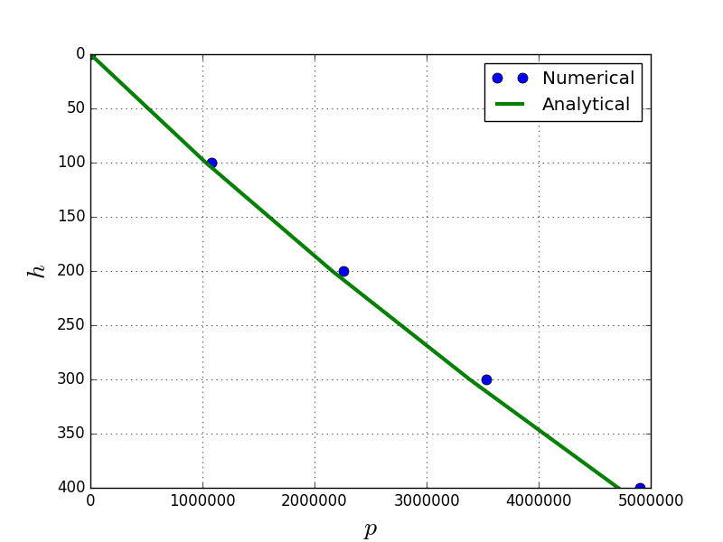
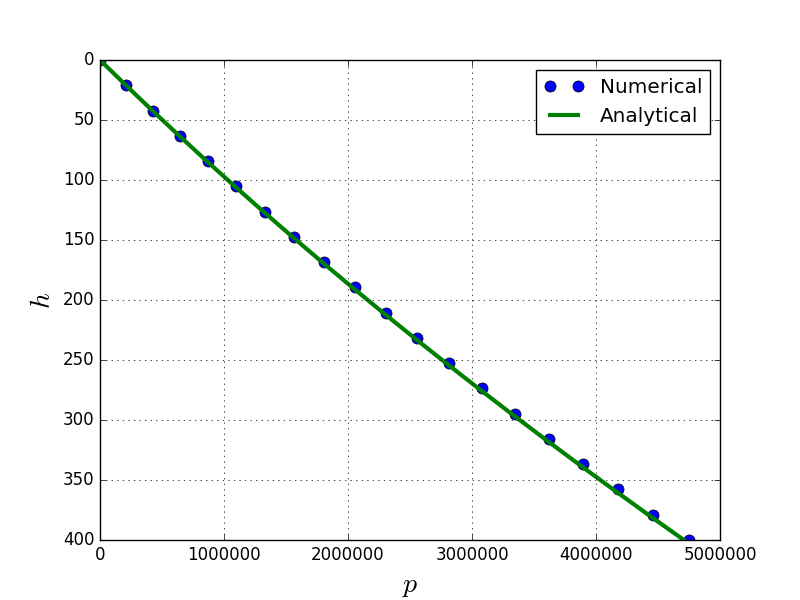

# Introduction to CFD
## Background and Motivation
Computational fluid dynamics, commonly known by its abbreviation CFD, is made of three words. The word ‘computational’ stands for techniques which can be programmed effectively to solve problems using computers. The techniques used in CFD are numerical in nature and computers are used to do repetitive logical computations. The words, ‘fluid and dynamics’ means related to gases and liquids in motion and being acted upon by forces or imparting forces on other objects. However, the currently available software using the CFD techniques are not limited only to fluid dynamics. The techniques learnt in CFD are applicable to any physical phenomena which can be modeled in form of partial differential equations (PDEs) or integral equations. The governing equations for a well understood physical phenomenon, under the assumption of continuum, is fairly easy to obtain and test for simple problems. On the other hand, solving these PDEs for complicated geometries (for real world applications) and arbitrary time scales is not very easy and in many cases general closed form solutions are not possible even with extreme mathematical rigor. This is where CFD techniques come in for rescue.

## Applications
The areas in which CFD techniques are applied are enormous and evolving. As a matter of fact, if you have an unsolved problem defined as a PDE or integral equations, than you can apply CFD techniques to solve your problem. As such, the areas of application are continuously growing. Some of these applications are in the fields listed below.

<table>
  <tr>
    <td><ul>
      <li>Aerospace engineering</li>
      <li>Automobile engineering</li>
      <li>Civil engineering</li>
      <li>Chemical engineering</li>
      <li>Shipbuilding engineering</li>
      <li>Internal Combustion Engines</li>
      <li>Wildfire simulations</li>
    </ul></td>
    <td><ul>
      <li>Evacuation planning</li>
      <li>Ground water simulations</li>
      <li>Petroleum explorations</li>
      <li>Weather predictions</li>
      <li>Biomedical applications</li>
      <li>Entertainment industry</li>
      <li>Pollution control</li>
    </ul></td>
  </tr>
</table>

TODO: Add pictures of applications

This list is in no way a comprehensive list, as there are countless applications where CFD is relied upon for quick decision making and saving lot of money. In general, CFD is used for simulating conditions where analytical tools are inadequate and experiments are too expensive, hazardous or just not possible. In fact, if you type any of these applications in your favorite internet search engine, you will find lot of examples where CFD is used.

## How Does CFD Work?
The process of CFD is made up of the following three steps:
1. **Pre-processing** or setting up the problem and geometry and making it solvable by computer.
2. **Solving** or numerical manipulations to solve for the parameters of interest at required points in space and time.
3. **Post-processing** or displaying results so that the solution is presented in a much more understandable way, then just numbers.

These three steps are explained with a simple example problem by solving the differential equation for hydrostatic law. Consider a problem, where we need to calculate the pressure under the ocean at a depth of  below the water level. The differential equation is the well-known hydrostatic law given by, , where  is the pressure,  is the density,  is the acceleration due to gravity and  is the depth. To make things interesting, let us assume that the density is a function of depth given by . A schematic of this problem is shown in figure below.


Before attempting to solve this problem numerically, let us solve it analytically using the rules of calculus. Integrating the differential equation between  and , we get, 
 

 


This is the exact solution of pressure governed by the differential equation at a depth of , with the assumed density distribution. Some observations that one can make here are,
1. We have obtained a closed form solution. In other words, we may substitute any value of depth in place of  to obtain an exact solution of pressure as required.
2. However, if the density function was complicated then carrying out the integration would have been very difficult. In fact, for problems in two or three dimensions it may not be possible to integrate complicated coupled functions over a general geometry analytically.

Now let us attempt to solve this problem numerically. Before we start, we need to understand that computers cannot efficiently work with continuous equations or obtain closed form solutions. So we need to prepare the geometry and equations in a discrete form, also known as the **pre-processing** step. The basic idea is to divide the domain (fluid depth), where we want to apply the differential equation, into smaller parts so that the integration can be performed numerically part by part. This process of division of geometry is also known as meshing or grid-generation. This being a simple equation with one independent variable , the domain can be represented by a straight line. It is therefore very easy to divide the domain by laying down  number of points as shown in figure below.


The  grid points are numbered as ; and the corresponding depths and pressures are denoted as  and  respectively. Using the definition of derivatives we may write,


 Assuming that the value of  is very small, we may drop the limit to obtain an approximation for the derivative as, 
 
 
 
 Evaluating the derivative at an arbitrary point, , in the domain we can write the above equation as, 
 
 
 
 This is the end of the pre-processing stage of CFD process.
 
 ----
 
 The **solver** step starts by substituting the discretized form of derivatives into the governing equation (hydrostatic law) to obtain an approximate form of governing equation. The governing equation, 
 
 
 
 may be therefore written at point, , as, 
 
 
 
 
 
 Here,  is the density at point , which can be easily obtained by using the function for density as  and the value of depth , assuming uniform division of the domain. The approximate form of the governing equation is basically an algebraic equation which can be solved by a computer to obtain an approximate solution. Writing descrete form of governing equation for point , we get, 
 
 
 
 
 
 Since the gauge pressure at the surface of the ocean can be taken as zero, , this results in 
 
 
 
 This is the numerically calculated pressure for point . The value of  depends on the number of divisions chosen for discretization of the domain. If we choose , then , since there are 4 parts of the domain with 5 points. In general we will get . Continuing with the calculation of pressure for the next few points ,  and  using descrete form of governing equation we get,
 
 
 
 
 
 
 
 It can be observed that we can progressively calculate the value of pressure at grid points with increasing depth applying the descrete governing equation again and again. Let us now manually do some calculations to obtain the pressure values at various grid points. Let us choose , therefore . Substituting  in equation for  we can obtain a solution as . The unit of the pressure as Pascal is an outcome of using consistent standard units for all the substitutions. Computers do not understand physical units, so we need to make sure that all numbers are in consistent standard units. Moving on, let us now calculate the pressure at point 2. Now using equation equation for  we can substitute the already calculated value of  and  to obtain the pressure . Therefore, . Continuing the calculation let us now use equation for  for calculation of pressure at point 3 which turns out to be . Finally, the value that we are interested in . Compare this value to the analytically calculated value of . There is such a huge error . However, it makes more sense to look at the percentage error, which turns out to be, . The behavior of error and its understanding is very important and we will look at it briefly in the next section. But before we do that, let us make a couple of observations to contradict with the analytical solutions. The numerical solutions obtained have the following characteristics:
1. The solution process did not require any application of the rules of calculus. The approximate integration was done purely by algebraic additions, which computers can perform easily. This is beneficial as the process can be generalized to very complex geometries.
2. The solution is obtained only at few discrete points along the depth. We do not have a continuous solution and therefore this is more of an engineering solution. If you want to analyze the solution mathematically then this is of not much use.

This is the end of the solver step and next step in the CFD process is post-processing.

----

The **post-processing** step mostly refers to visualization of the data produced by the solver in a meaningful manner. However, it may mean other things like generation of report or passing on the data as input to other processes. The visualization of data can be done in numerous ways, like line or point graph, histogram or bar charts, contour plots, generation of images from the data etc. For visualization of the data I am using the matplotlib library from Python to draw a simple line plot of pressure versus depth as shown in figure below.



A simple problem was chosen to provide with an insight into the steps of CFD: pre-processor, solver and post-processor. The main reason for this distinction between steps is that in large industries, working on CFD simulations, these processes are separated into different departments. Each of the three steps are very important and lot of research has been done and is continuing in each of these fields for complicated geometries, robust solvers and better visualization of results.

## Errors in CFD
The results obtained using CFD approach are not exact as seen earlier by comparing the numerical solution with analytical solution. The difference between the exact and numerical solution is termed as error and is generally measured as relative error or percentage error. In case of the example solved above the error in pressure may be written as,


 The advantage of using the relative or percentage error over absolute error is that in case of the former the error is automatically scaled. However, care must be taken to make sure that the denominator is not equal to zero. The errors occurring in CFD can be broadly classified into two types:

1. Discretization error: The discretization error can be due to geometry discretization and PDE discretization.
    1. Geometry discretization: error due to approximating the complicated geometry with simple sub-geometries.
    2. PDE discretization: error due to approximating the PDE (or integral equation) with simplified algebraic equations. This error is the cause of most of the complexity in CFD formulations.
2. Equation modeling error: The PDE being solved might itself be an approximation to the real physical phenomenon. For example, the PDE might be neglecting the effects of gravity or viscosity or magnetic fields which may modify the solution marginally, but simplifying the PDE considerably. The error due to such a simplification of PDE is termed as equation modeling error. Therefore while solving a problem the underlying PDE must be critically analyzed for suitability for the designed application, otherwise the error due to simplification of PDE may render the solution unusable for the desired application.

### Effect of mesh refinement
The addition of points to refine mesh has a dual advantage of capturing the geometry better (thus reducing geometry discretization error) and reducing the mesh size, i.e. value of  (thus reducing the PDE discretization error). In the previous example therefore we may expect reduction of error by increasing the number of grid points. If we recalculate the value of pressure at a depth of , but now with say 8 divisions instead of 4 divisions, we now have a  of  instead of . Writing algebraic equations for each of the 8 grid points results in 8 equations instead of 4 equations. The error reduces to  and we obtain a pressure of  at the depth of  as the numerical solution. The additional accuracy in solution comes at an additional computational cost.

## Program for solving hydrostatic differential equation
```python
import numpy as np
import matplotlib.pyplot as plt

g = 9.81
def analytical_p(h):
    return (1000 * h + h**2 / 2) * g
    
def rho(h):
    return 1000.0 + h
    
H = 400.0
N = 20

p = np.zeros(N)
dh = H / (N - 1)

for i in range(1, N):
    h = i * dh
    p[i] = p[i-1] + rho(h) * g * dh
    
print("%f"%p[N-1])
plt.gca().invert_yaxis()
height = np.linspace(0.0, H, N)

plt.plot(p, height, "o", label="Numerical", ms=8)
plt.plot(analytical_p(height), height, "-", lw=3, label="Analytical")

plt.xlabel("$p$", fontsize=20)
plt.ylabel("$h$", fontsize=20)

plt.grid()
plt.legend(loc="best")

plt.savefig("pressure.png")
plt.show()
```
This is the first CFD code in this book and this book and the accompanying repository is full of CFD codes. In fact, one of the objectives of this book is to display CFD techniques through coded examples. It is a firm belief of the author, that CFD can be learnt only by practicing it, by writing your own code. Therefore, I urge you to rewrite all the example code using a programming language of your interest and reproduce the plots and results given in this book. The figure below shows the result produced by the program for solving the hydrostatic differential equation.



## This is just the beginning...
Computational fluid dynamics is much more than solution of one-dimensional ordinary differential equation. The example presented earlier was to give a very broad overview of the CFD process. The equations solved in the real world of CFD are very complicated and require knowledge of behavior of PDEs to tackle the problems. The next chapter presents the governing equations of fluid flows which are fairly complicated and tightly coupled system of equations. Later the various PDE types and their behavior is explained in detail and the methodology to be used for solving them. All the explanations are accompanied with proper demonstration code to reinforce the concepts presented. The reason for including this section is to encourage you and make you aware of what is yet to come in subsequent chapters. After reading further a few more chapters you will feel comfortable to take over the world of CFD.
